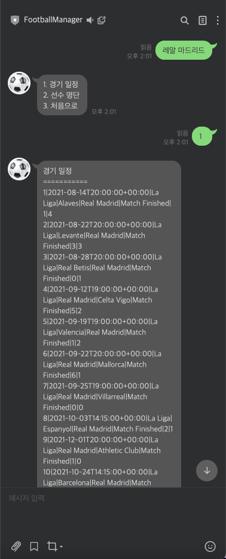
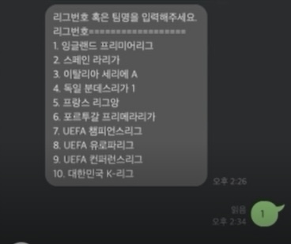

# 축구관련 정보제공 챗봇
 [] (https://nodejs.org/ko/)
 [] (https://expressjs.com/ko/)
<!--Table of Contents-->
## Table of Contents
1. About the Project
2. Getting Started (Installation)
3. Usage
4. Roadmap
5. Contributing
6. Contact

<p align="right">(<a href="#top">back to top</a>)</p>

<!--About The Project-->
## About The Project
- Line 채널 ID로 챗봇을 추가하여 사용할 수 있습니다.
- 해당 챗봇을 통하여 경기 일정과 소속선수 그리고 팀, 득점, 도움 순위 정보를 제공합니다.
- Papago API를 이용하여 한글과 영어 입력이 모두 지원 가능하도록 했습니다.

### Built With
- [Node.js](https://nodejs.org/ko/)
- [Express](https://expressjs.com/ko/)
- [Javascript](https://developer.mozilla.org/ko/docs/Web/JavaScript)
- [Line API](https://developers.line.biz/en/services/messaging-api/)
- [Papago API](https://developers.naver.com/apps)
- [Sports API](https://www.api-football.com/documentation-v3#section/Authentication)

<p align="right">(<a href="#top">back to top</a>)</p>

<!--Getting Started (Installation)-->
## Getting Started

### Prerequisites
- npm
```
npm install
```

### Installation
- Messaging API
1. Get a free API Key at <https://developers.line.biz/en/services/messaging-api/>
- Sports API
2. Get a free API Key at <https://www.api-football.com/>
3. Clone the repo
```
git clone http://khuhub.khu.ac.kr/2018102191/enjoy_soccer.git
```
3.Install NPM packages
```
npm install
```
<p align="right">(<a href="#top">back to top</a>)</p>

<!--Usage-->
## Usage
1. Line 앱에서 "FootballManager" 채널을 추가해 주세요.  
   - 라인 채널 아이디 : @561ankpu
   
2. 채팅창에 들어가면 챗봇이 안내 문구를 전송합니다.  
</img><br/>

3. 안내 문구에 따라 리그 번호 혹은 팀명을 입력합니다.
</img><br/>  
<p align="right">(<a href="#top">back to top</a>)</p>

<!--Roadmap-->
## Roadmap
- [x] Line 채널 만들기
- [x] 한->영, 영->한으로 메세지 번역하기
- [x] leagueID로 teamID 받아오기
- [x] teamID로 leagueID 받아오기
- [x] 메세지 공백 처리하기
- [x] 기능 별 Sports API에서 추출한 json파일 파싱하는 함수 구현하기

<p align="right">(<a href="#top">back to top</a>)</p>

<!--Contributing-->
## Contributing
1. Fork the Project
2. Create your Feature Branch (git checkout -b feature/AmazingFeature)
3. Commit your Changes (git commit -m 'Add some AmazingFeature')
4. Push to the Branch (git push origin feature/AmazingFeature)
5. Open a Pull Request

<p align="right">(<a href="#top">back to top</a>)</p>

<!--Contact-->
## Contact
- 박찬수 : suplife0@khu.ac.kr
- 백지원 : wldnjsl2001@khu.ac.kr
- 차가민 : gmcha0323@khu.ac.kr
- Project Link : http://khuhub.khu.ac.kr/2018102191/enjoy_soccer

<p align="right">(<a href="#top">back to top</a>)</p>